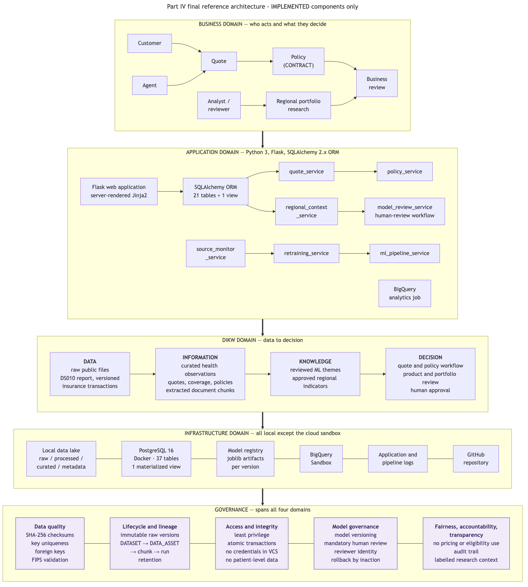

# NYU CSCI-GA.2433-001 Database Systems — Course Project

Alan · Summer 2026 · Instructor: Jean-Claude Franchitti

An insurance enterprise data architecture built across four milestones: a
conceptual model, a hybrid logical schema with a four-zone data lake, an
optimized physical PostgreSQL 16 database carrying a machine-learning model over
unstructured data, and a working end-to-end application that ties all of it
together.

**This repository holds the final version of every part, I through IV.**

---

## Where each part lives

| Part | Deliverable | Directory | Key artifacts |
|------|-------------|-----------|---------------|
| **I** | Conceptual ER model, 20 entities in 4 subject areas | [`part1/`](part1/) | `EDA_ER_Diagram.mmd/.png/.pdf`, `Project_Part1_Report.docx` |
| **II** | Logical schema (26 tables), four-zone data lake, 10 public datasets | [`part2_data_lake/`](part2_data_lake/) | `logical_model/`, `curated/`, `metadata/`, `scripts/01–05`, `scripts/download_part2_data.py`, `report/Project_Part2_Report.docx` |
| **III** | Physical design, quote workflow, TF-IDF + K-means model, cloud analytics | [`part2_data_lake/`](part2_data_lake/) | `database/`, `ml/`, `workflows/`, `architecture/`, `scripts/run_part3_*.sh`, `report/Project_Part3_Report.docx` |
| **IV** | End-to-end application, ORM, source monitoring, failure-safe retraining | [`part4/`](part4/) | `app/`, `jobs/`, `tests/`, `db/`, `scripts/`, `evidence/`, `report/Database_Systems_Final_Project_Report.docx` |

Parts II and III share the `part2_data_lake/` directory. It was created for
Part II and Part III was built inside it, so the name is historical rather than
descriptive. The table below is the file-level map.

### Part II — logical model and data lake

```text
part2_data_lake/
├── logical_model/          26-table logical schema, DDL and diagrams
├── raw/ processed/ curated/ metadata/    the four data-lake zones
│                           raw/ and processed/ are excluded from git; see "Restoring data"
├── curated/                the five curated tables the loaders read
├── metadata/               dataset catalogue, download manifest with SHA-256 per source
├── scripts/download_part2_data.py        fetches the 10 public datasets
├── scripts/01..05_*.py     inventory, profile, curate, validate, sample
└── report/Project_Part2_Report.docx
```

### Part III — physical design and machine learning

```text
part2_data_lake/
├── database/
│   ├── physical/           7 DDL files: schema, indexes, quote workflow,
│   │                       ML metadata, materialized views, roles, partitioning
│   ├── queries/            workload queries, EXPLAIN scripts, BigQuery analytics
│   ├── tests/              constraint tests and a pytest suite
│   └── evidence/           performance results and query-plan analysis
├── ml/
│   ├── config.yaml         every value that affects model output
│   ├── src/                extract, chunk, preprocess, train, evaluate, export
│   ├── models/             trained TF-IDF vectorizer, K-means model, metadata
│   ├── outputs/            chunks, assignments, cluster summaries, metrics, plots
│   └── tests/
├── workflows/              quote-to-contract use cases and diagrams
├── architecture/           Part II and III diagrams, governance docs, cloud evidence
├── scripts/run_part3_*.sh  database build, ML run, cloud analytics
├── docs/                   design decisions, limitations, Part III traceability
└── report/Project_Part3_Report.docx
```

### Part IV — end-to-end application

```text
part4/
├── app/                    Flask app: config, db, ORM models, 7 services, routes, templates
├── db/                     Part IV DDL: ML_CLUSTER_INDICATOR_MAP, sequences, indexes, role
├── jobs/                   monitor_unstructured.py, retrain_model.py
├── tests/                  8 pytest suites, 96 tests, run against live PostgreSQL
├── scripts/                database build, demonstrations, measurement, screenshots, cloud
├── architecture/diagrams/  5 diagrams (Mermaid source + SVG + PNG)
├── evidence/               10 screenshots, test output, query measurements, plans
├── model_registry/         versioned model artifacts, one directory per version
├── docs/                   requirements traceability matrix
└── report/                 the final project report
```

---

## What Part IV adds

A Flask + SQLAlchemy application over the Part III PostgreSQL database, plus a
data-driven module that watches the unstructured source and retrains the model
when it changes.

* **Quote to policy.** Create a quote, add coverage, move through
  Draft → Submitted → Rated → Presented → Accepted, authorize payment, issue a
  policy. Issuance writes CONTRACT, CONTRACT_BENEFIT, CONTRACT_PREMIUM,
  QUOTE_CONVERSION, the quote status, and its history row in one transaction.
  `UNIQUE(QuoteID)` makes a second policy impossible.
* **Source monitoring.** SHA-256 content comparison against `DATA_ASSET.SHA256`,
  not modification time. An unchanged source produces no model run.
* **Failure-safe retraining.** A changed source is preserved as a new immutable
  raw version, then the Part III pipeline retrains. The active model is the
  completed run with the latest completion time, so a failed run is recorded and
  never becomes active.
* **Governed ML integration.** A cluster becomes business insight only after a
  named analyst reviews it *and* an active `ML_CLUSTER_INDICATOR_MAP` row links
  it to an existing health indicator. Two independent gates.
* **Regional research context.** County-level public-health aggregates shown on
  the quote page, labelled *research context — not a rating input*. The pricing
  function takes a coverage limit and a deductible and nothing else.



Process diagrams:
[end-to-end workflow](part4/architecture/diagrams/part4_end_to_end_workflow.png) ·
[quote-to-policy sequence](part4/architecture/diagrams/part4_quote_to_policy_sequence.png) ·
[retraining sequence](part4/architecture/diagrams/part4_retraining_sequence.png) ·
[ML-to-ODS integration](part4/architecture/diagrams/part4_ml_to_ods_integration.png)

---

## Setup

Requirements: Python 3.11+ (developed on 3.13), Docker for PostgreSQL 16, and
optionally `bq`/`gcloud` for the BigQuery step and Node for regenerating
diagrams.

```bash
python3 -m pip install -r part2_data_lake/scripts/requirements.txt
python3 -m pip install sqlalchemy flask "psycopg[binary]" pytest playwright
```

Start the database and configure credentials — nothing is stored in this
repository:

```bash
docker run -d --name part2-postgres -e POSTGRES_PASSWORD=<your-password> -p 5432:5432 postgres:16
cp part4/.env.example part4/.env    # then fill in the password
```

Build the schema:

```bash
bash part2_data_lake/scripts/run_part3_database.sh   # Part II schema + Part III physical layer
bash part4/scripts/run_part4_database.sh             # Part IV extension
```

## Running

All commands run from this directory.

```bash
python3 -m part4.run                                   # http://127.0.0.1:5055
python3 -m part4.jobs.monitor_unstructured --once      # source change detection
python3 -m part4.jobs.monitor_unstructured --watch     # continuous polling
python3 -m part4.jobs.retrain_model --current          # manual retraining
```

## Tests and demonstrations

```bash
python3 -m pytest part4/tests -v                       # Part IV: 8 suites, 96 tests
python3 part4/scripts/run_part4_demo.py                # 16-step quote-to-policy walkthrough
python3 part4/scripts/run_part4_retraining_demo.py     # retraining tests A, B, B2, C, D
python3 part4/scripts/measure_part4_queries.py         # query and ORM measurements
python3 part4/scripts/capture_part4_screenshots.py     # screenshots (app must be running)
bash part4/scripts/run_part4_cloud_analytics.sh        # BigQuery Sandbox
```

Part III's own suites run from inside its directory:

```bash
cd part2_data_lake && python3 -m pytest ml/tests database/tests -v
```

## Restoring the excluded data

`part2_data_lake/raw/`, `processed/`, `sample_data/`, and the Part IV retraining
fixtures are excluded from version control: about 320 MB of public downloads and
derived files, all reproducible.

```bash
cd part2_data_lake
python3 scripts/download_part2_data.py     # re-downloads the 10 public datasets
python3 scripts/01_inventory_data.py
python3 scripts/02_profile_data.py
python3 scripts/03_build_curated_data.py
cd ../part4
python3 tests/fixtures/make_fixtures.py    # rebuilds the retraining fixtures
```

`part2_data_lake/metadata/download_manifest.json` records each source URL and its
expected SHA-256, so a restored file can be verified against the bytes the
project was built on.

## Limitations

* The demonstration premium is `limit/1000 × 4.25 − deductible × 0.05`. It is a
  placeholder for a rating engine, not a filed insurance rate.
* `HEALTH_OBSERVATION` holds a 320-row sample of the public data, so a county
  carries at most three observations. `part4/db/02_part4_demo_context.sql` gives
  ten demonstration accounts several service areas so the regional screen has
  enough rows to be legible; no observation value is invented.
* Customer, account, and contract rows are synthetic demonstration data. The
  public health data, the source report, and every model result are real.
* No authentication layer. Reviewer and actor names are recorded for audit but
  are not authenticated identities.
* The application runs on Flask's development server on localhost.
* BigQuery runs in Sandbox mode: no billing account, no Cloud Storage.
