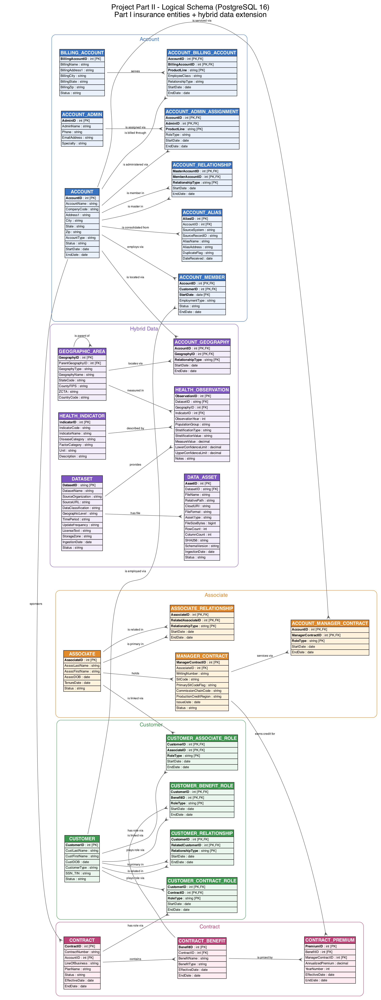
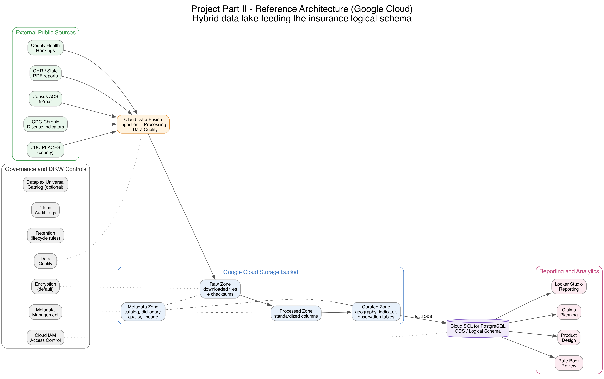

# New York University
Computer Science Department
Courant Institute of Mathematical Sciences

# Database Systems Project Part II
**Logical Schema Optimization and Unstructured Data Collection**

Student: Alan Mo
NetID: bm3883
Course: CSCI-GA.2433-001 Database Systems
Instructor: Jean-Claude Franchitti
Due Date: 07/23/26

---

## 1. Introduction

This report covers Project Part II. Part I created a conceptual ER model for an insurance company. Part II turns that model into a logical relational schema.

The project also builds a small data lake of public health data. It links the insurance schema to this data through geographic areas. The goal is to support future chronic disease forecasting. This project does not build a prediction model and does not generate forecasts.

## 2. Project Scope

The project covers six parts:

- Schema generation from the Part I model.
- Schema optimization and normalization.
- A small data lake with public datasets.
- A hybrid model that links structured and public data.
- A reference architecture on Google Cloud.
- Cloud storage scripts for the samples and metadata.

The database target is PostgreSQL 16. The project does not store patient-level data. All public health data is aggregate and regional.

## 3. Part I Model Summary

The Part I model has 20 entities in four subject areas.

| Subject area | Main idea | Example entities |
| --- | --- | --- |
| Account | Employer, group, or direct accounts and their links | ACCOUNT, ACCOUNT_ALIAS, BILLING_ACCOUNT |
| Customer | People or legal entities and their roles | CUSTOMER, ACCOUNT_MEMBER, CUSTOMER_CONTRACT_ROLE |
| Associate | Sales associates and selling agreements | ASSOCIATE, MANAGER_CONTRACT |
| Contract | Contracts, benefits, and premiums | CONTRACT, CONTRACT_BENEFIT, CONTRACT_PREMIUM |

The model uses surrogate primary keys for main entities. It uses associative entities for many-to-many relationships. It uses RoleType and RelationshipType fields for business roles. It uses StartDate and EndDate for history.

## 4. Dataset Collection

The data lake holds ten public datasets from three organizations. The files were downloaded from official sources and were not changed.

| Name | Source | Format | Geo level | Time | Purpose | Key fields |
| --- | --- | --- | --- | --- | --- | --- |
| CDC PLACES County | CDC | CSV | County | 2022-2023 | Chronic disease outcomes and risk behaviors | LocationID (county FIPS) |
| Chronic Disease Indicators | CDC | CSV | State | Multiple | Chronic disease indicators | LocationAbbr, LocationID |
| County Health Rankings (national) | CHR & Roadmaps | XLSX | County/State | 2025 | Health outcomes and factors | FIPS |
| County Health Rankings (analytic) | CHR & Roadmaps | CSV | County/State | 2025 | Analysis-ready measures | fipscode |
| County Health Rankings (dictionary) | CHR & Roadmaps | XLSX | Doc | 2025 | Measure definitions | Variable Name |
| ACS S0101 Age and Sex | Census | CSV | County | 2024 | Age and sex profile | GEO_ID, state, county |
| ACS S1901 Income | Census | CSV | County | 2024 | Household income | GEO_ID, state, county |
| ACS S1701 Poverty | Census | CSV | County | 2024 | Poverty status | GEO_ID, state, county |
| ACS S2701 Health Insurance | Census | CSV | County | 2024 | Health insurance coverage | GEO_ID, state, county |
| 2025 CHR&R Report (PDF) | CHR & Roadmaps | PDF | National | 2025 | Unstructured annual findings report | None (document) |

The datasets share a county key. The 5-digit county FIPS code is the main join key across sources. This key connects public data to internal accounts through a geography table.

The CSV and XLSX tables are structured data. The JSON download manifest and the XLSX data dictionary are semi-structured. The 2025 CHR&R Report PDF is the unstructured document. It is stored in the raw zone and recorded as dataset DS010 in the DATASET and DATA_ASSET tables.

## 5. Data Lake Design

The data lake uses four zones.

| Zone | Purpose | Example content |
| --- | --- | --- |
| Raw | Store downloaded files without changes | CDC and Census CSV and XLSX files, checksums |
| Processed | Store cleaned source-specific files | PLACES file with standardized column names |
| Curated | Store common shared tables | geography, indicator, observation tables |
| Metadata | Store catalog and lineage | dataset catalog, data dictionary, quality report, lineage |

The raw zone keeps the original files and their SHA-256 checksums. The processed zone standardizes column names and codes. The curated zone holds small tables that match the hybrid schema. The metadata zone records where each file came from and how it was built.

Five Python scripts run the pipeline. They inventory files, profile data, build curated tables, validate outputs, and create submission samples. The scripts use a fixed random seed so the sample is reproducible.

## 6. Logical Schema

The logical schema has 26 tables. There are 20 Part I tables and 6 hybrid tables. The schema is written for PostgreSQL 16.

*Figure 1. Logical schema grouped by subject area. Part I entities plus the hybrid data extension.*

The diagram groups tables by subject area. Primary keys and foreign keys are marked. The main tables are:

| Table | Role |
| --- | --- |
| ACCOUNT | The central account record |
| CUSTOMER | A person or legal entity |
| ASSOCIATE | A sales associate |
| CONTRACT | A contract linked to one account |
| CONTRACT_BENEFIT / CONTRACT_PREMIUM | Benefits and their priced premiums |
| Associative tables | Resolve many-to-many links and store roles and history |

The full column list is in logical_schema_data_dictionary.csv. It is not repeated here.

## 7. Logical Schema Optimization

The schema was checked for first, second, and third normal form. Each table meets third normal form. The full review is in normalization_review.csv.

| Optimization | Change | Reason |
| --- | --- | --- |
| First normal form | Each field holds one value | Removes repeating groups |
| Second normal form | Non-key columns depend on the full key | Correct use of composite keys |
| Third normal form | No column depends on another non-key column | Removes transitive links |
| Primary keys | Surrogate keys on main entities | Simple and stable keys |
| Foreign keys | 33 foreign keys added | Enforce valid links |
| Unique constraints | Account business key, manager contract, contract number | Keep natural uniqueness |
| Check constraints | StartDate <= EndDate and self-relationship checks | Block bad date ranges and self links |
| Historical dates | StartDate and EndDate on relationships | Support history |
| Structured/unstructured link | Six hybrid tables added | Connect the schema to the data lake |

The account uniqueness rule uses AccountName, Address1, City, State, Zip, and CompanyCode. The manager contract rule uses AssociateID, WritingNumber, and SitCode. Recursive tables use two foreign keys with a check that blocks self links.

RoleType, RelationshipType, ProductLine, Status, and CustomerType stay as coded text fields. This is a simplification. It avoids many small lookup tables and keeps the design clear.

## 8. Hybrid Data Model

The hybrid extension adds six tables. They connect the insurance schema to the public data.

| Entity | Purpose |
| --- | --- |
| DATASET | Metadata about each public dataset |
| DATA_ASSET | One row per physical file or object |
| GEOGRAPHIC_AREA | A common geographic key for internal and external data |
| HEALTH_INDICATOR | A disease, risk factor, or population measure |
| HEALTH_OBSERVATION | An aggregate regional value for an indicator |
| ACCOUNT_GEOGRAPHY | Links an account to one or more geographic areas |

The link works through geography. An account joins to a geographic area with ACCOUNT_GEOGRAPHY. Public health data joins to the same area with HEALTH_OBSERVATION. This lets the company compare an account's region to public health measures.

The public data is aggregate. It describes counties and states, not people. The model does not connect a health observation to a named customer. The regional link lowers privacy risk and keeps the project scope small.

CONTRACT and CONTRACT_PREMIUM stay internal structured data. DATASET and DATA_ASSET give metadata and lineage. HEALTH_OBSERVATION holds curated values that come from the raw files.

## 9. Reference Architecture

The reference architecture uses Google Cloud. It shows how data flows from public sources to reporting. The project first targeted Microsoft Azure. The student account could not create an Azure subscription, so the design moved to Google Cloud. The zones and flows did not change. Only the service names changed.

*Figure 2. Reference architecture on Google Cloud.*

| Component | Google Cloud service | Role |
| --- | --- | --- |
| Ingestion | Cloud Data Fusion | Copies files and runs cleaning and quality checks. |
| Data lake | Cloud Storage (GCS) | Holds the raw, processed, curated, and metadata zones. |
| Database | Cloud SQL for PostgreSQL | Holds the logical schema as an operational data store. |
| Reporting | Looker Studio | Shows reports and dashboards as an example consumer. |
| Governance | Dataplex Universal Catalog (optional) | Tracks datasets and lineage. |

The flow is: external sources, then the raw zone, then processing and data quality, then the curated zone, then PostgreSQL, then reporting and business review.

The architecture also shows metadata, Cloud IAM access control, default encryption, lifecycle retention rules, and Cloud Audit Logs. A small DIKW mapping applies:

| DIKW layer | In this project |
| --- | --- |
| Data | Raw public datasets and internal transactions |
| Information | Clean regional indicators and contract summaries |
| Knowledge | Approved analysis outputs and business rules (future work) |
| Decision | Claims planning, product review, and rate book updates (future work) |

This project builds the Data and Information layers. It does not build the Knowledge or Decision layers. The architecture supports that future work.

## 10. Cloud Storage

The data lake samples were uploaded to Google Cloud Storage. The student ran the upload script gcloud_upload.sh with their own Google Cloud account on 07/23/26.

The script created a Cloud Storage bucket in us-east1 with uniform bucket-level access. It uploaded the metadata, curated, and sample_data folders. The bucket holds 23 objects. The full raw datasets were not uploaded.

The evidence files are in architecture/cloud_evidence/: an upload manifest with object names and sizes, a command log with the project and bucket names masked, and a validation note. No secrets are stored in the repository.

The Cloud SQL database step in the deployment guide is optional and was not executed. The logical schema was validated in a local PostgreSQL 16 instance instead. See Section 11.

## 11. Validation

The work was validated with several checks.

| Area | Result |
| --- | --- |
| Script validation | All five scripts ran and exited with status 0. |
| SQL validation | The schema loaded in PostgreSQL 16 with no errors. 26 tables, 33 foreign keys, and 19 check constraints were created. |
| Sample join | A test join from ACCOUNT to HEALTH_INDICATOR returned the expected row. |
| Data quality | 14 data checks passed. Keys are unique and foreign keys resolve. |
| Curated load | The curated tables loaded into PostgreSQL with no foreign key errors (10 dataset, 3,196 geography, 148 indicator, 10 data asset, 320 observation rows). |
| Unstructured asset | The PDF report row joins DATASET and is marked as an unstructured document. |
| Raw files | All ten raw files matched their recorded checksums. No raw file was changed. |
| Diagram validation | Both diagrams rendered to PNG and PDF with Graphviz. |
| Cloud validation | The student ran the upload. 23 objects are in the Cloud Storage bucket. Evidence files are in architecture/cloud_evidence/. |

## 12. Assumptions and Limitations

- The project does not build a machine-learning model.
- The project does not generate disease predictions or claim forecasts.
- All public health data is aggregate and regional.
- No patient-level health record is stored.
- The observation table is a reproducible sample, not the full data.
- The cloud platform is Google Cloud. Azure was not available for the student account.
- The cloud upload covers metadata, curated, and sample files. Full raw datasets and the optional Cloud SQL database were not deployed.
- RoleType, RelationshipType, ProductLine, Status, and CustomerType stay as coded text fields.
- The submission holds a 3-page excerpt of the PDF report. The full 18-page PDF stays in the local raw zone.

## 13. Conclusion

Part II turns the Part I model into a normalized PostgreSQL 16 schema and adds a small hybrid extension that links insurance accounts to public health data through geographic areas. The data lake, curated tables, diagrams, and cloud scripts were built and validated, and the schema is in third normal form.

## 14. References

- CDC PLACES: Local Data for Better Health, County Data 2025. Centers for Disease Control and Prevention. https://data.cdc.gov/
- U.S. Chronic Disease Indicators. Centers for Disease Control and Prevention. https://data.cdc.gov/
- County Health Rankings & Roadmaps, 2025 data. University of Wisconsin Population Health Institute. https://www.countyhealthrankings.org/
- Building power for health and equity: 2025 County Health Rankings & Roadmaps Report. University of Wisconsin Population Health Institute, March 2025. https://www.countyhealthrankings.org/findings-and-insights/2025-report
- American Community Survey 5-Year Estimates, 2024 subject tables. U.S. Census Bureau. https://api.census.gov/
