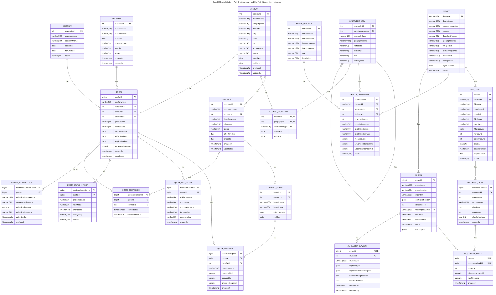
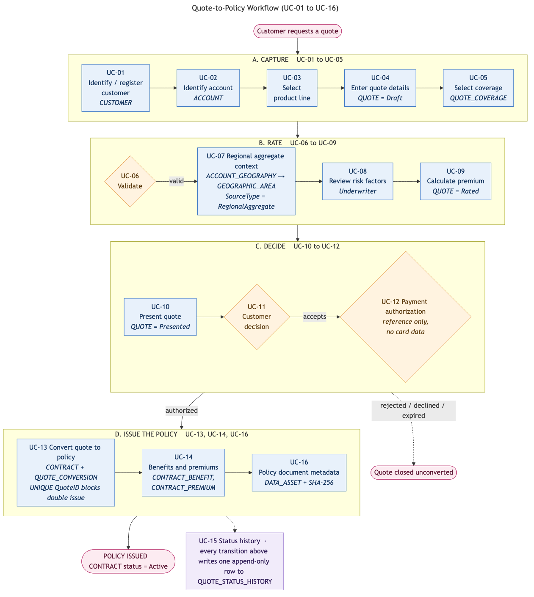
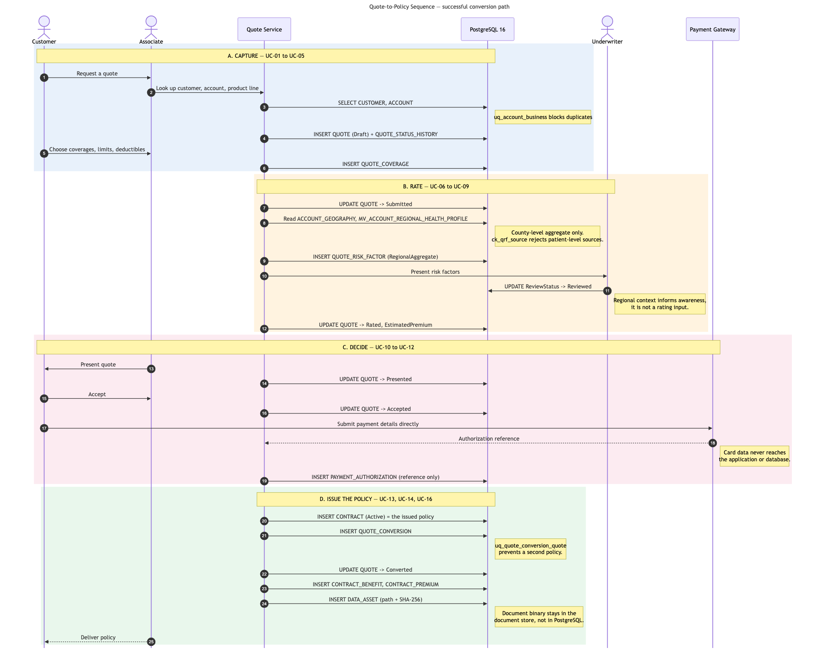
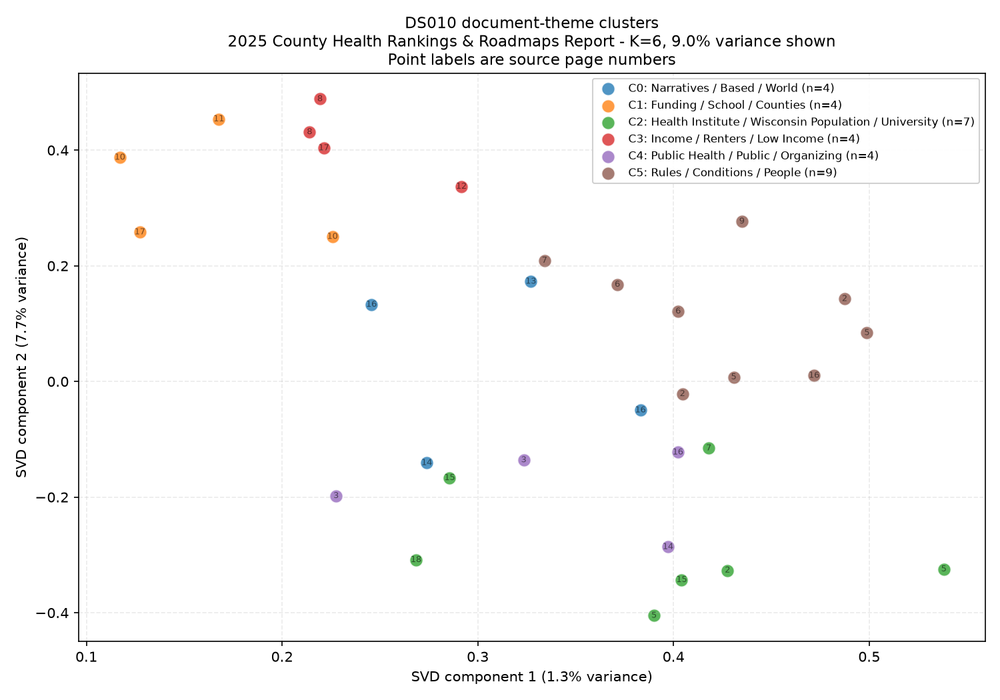
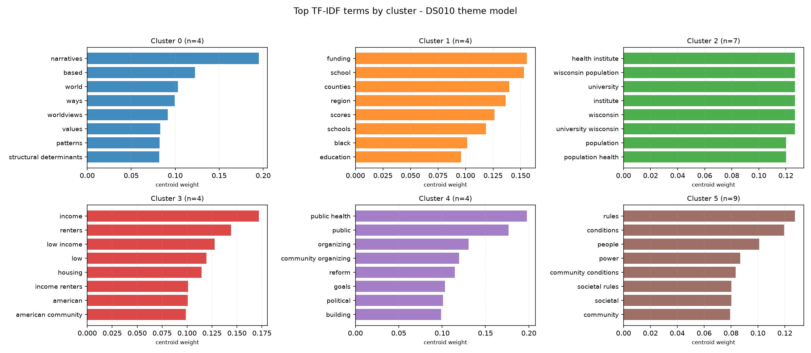
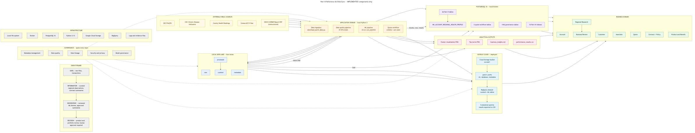

# New York University
Computer Science Department
Courant Institute of Mathematical Sciences

# Database Systems Project Part III
**Logical Schema Optimization and Machine Learning Model Creation**

Student: Alan Mo
NetID: bm3883
Course: CSCI-GA.2433-001 Database Systems
Instructor: Jean-Claude Franchitti
Session: 8
Due Date: 08/06/26


---


## 1. Executive Summary

Part III extends the Part II hybrid data model into a deployed physical database, a quote-to-policy workflow design, and a machine learning model over unstructured data.

Four results are worth stating up front.

| Area | Result |
| --- | --- |
| Physical design | 36 tables in PostgreSQL 16 (26 from Part II, 6 workflow, 4 ML governance), 48 foreign keys, 38 check constraints, 87 indexes, 1 materialized view. |
| Measured optimization | A composite index reduced a lookup from 7.121 ms to 0.032 ms on 500,000 rows, a 222x improvement. The materialized view answered the five-table hybrid query 2.7x faster than the live join. |
| Machine learning | TF-IDF and K-means over the DS010 report produced 6 themes from 32 text chunks. Silhouette 0.1212, which is weak and reported as such. |
| Governance | The model cannot write to any insurance table, and no cluster interpretation is approved until a named person reviews it, enforced by a database constraint. |

The cloud Big Data analytics requirement was executed on 08/06/26 using Google BigQuery. Seven tables were loaded and four analytical queries were run, with row counts verified against the local sources and all evidence captured with identifiers masked. BigQuery Sandbox was used because no billing account was open, and Cloud Storage requires one.


## 2. Part I and Part II Background

Part I produced a conceptual entity-relationship model with 20 entities in four subject areas: Account, Customer, Associate, and Contract. It used surrogate primary keys, resolved many-to-many relationships with associative entities, and carried history with StartDate and EndDate fields.

Part II generated a logical relational schema from that model and added six hybrid entities linking the insurance schema to a public health data lake. It also built a four-zone data lake holding ten public datasets and deployed sample data to Google Cloud Storage.

| Part II asset | Carried into Part III |
| --- | --- |
| 26-table logical schema (3NF) | The direct input to the physical design. No table renamed or dropped. |
| 33 foreign keys, 19 check constraints | Preserved and re-verified; now 48 and 38 with the Part III extensions. |
| Four-zone data lake, 10 datasets | Reused unchanged. All 10 raw checksums still match. |
| DS010 unstructured PDF | The sole training asset for the Part III machine learning model. |
| GCP reference architecture | Extended rather than redrawn. |

The six hybrid entities are DATASET, DATA_ASSET, GEOGRAPHIC_AREA, HEALTH_INDICATOR, HEALTH_OBSERVATION, and ACCOUNT_GEOGRAPHY. The five-digit county FIPS code is the common join key, and internal accounts reach public health data only through GEOGRAPHIC_AREA.


## 3. Part III Scope

| Assignment section | Delivered |
| --- | --- |
| 2.1 Physical database design | Indexing, partitioning evaluation, clustering evaluation, and selective materialization, each with a documented decision and measured evidence. |
| 2.2 Quote-to-policy workflow | 16 business use cases, six supporting tables, an activity diagram, and a sequence diagram. |
| 3.1 Refine use cases, evaluate Big Data ideas | Extended use cases plus a short/medium/long-term evaluation framework. |
| 3.2 Select and train ML algorithms | TF-IDF and K-means over the DS010 unstructured report. |
| 3.3 Develop the Big Data platform | Data lake extended with ML outputs; feedback path into the EDA defined; two visualizations produced. |
| 3.4 Elaborate the reference architecture | Separate implemented and future-state views across four domains. |
| 3.5 Cloud Big Data analytics | BigQuery dataset with 7 loaded tables and 4 executed analytical queries, evidence captured. |

Out of scope by design: no application program, no supervised disease prediction, no customer-level risk scoring, and no patient-level health records.


## 4. Existing Logical and Hybrid Schema

The Part II schema was loaded into a fresh PostgreSQL 16 database and verified before any Part III work began.

| Object | Count |
| --- | --- |
| Base tables | 26 |
| Foreign keys | 33 |
| Check constraints | 19 |
| Unique constraints | 3 |
| Indexes | 52 |

This matches the Part II report exactly, confirming the schema is a valid starting point. The verification is recorded in docs/part3_repository_inventory.md.


## 5. Physical Database Design

The physical design is applied as separate DDL files on top of the Part II schema, so the Part II deliverable remains exactly as submitted. A rollback script removes every Part III object and restores the end-of-Part-II state.



*Figure 1. Part III physical model: the 10 new tables and the Part II tables they reference, generated directly from information_schema on the deployed database. See part3_physical_model.svg for a full-resolution, zoomable version.*

Diagram source and rendered files:

| Artifact | Path |
| --- | --- |
| Physical model, Mermaid source | architecture/diagrams/part3_physical_model.mmd |
| Physical model, vector | architecture/diagrams/part3_physical_model.svg |
| Physical model, raster | architecture/diagrams/part3_physical_model.png |
| Implemented reference architecture | architecture/diagrams/part3_reference_architecture.{mmd,svg,png} |
| Future-state reference architecture | architecture/diagrams/part3_future_state_architecture.{mmd,svg,png} |
| End-to-end data flow | architecture/diagrams/part3_data_flow.{mmd,svg,png} |
| Quote-to-policy workflow | workflows/quote_to_policy_workflow.{mmd,svg,png} |
| Quote-to-policy sequence | workflows/quote_to_policy_sequence.{mmd,svg,png} |

The physical model diagram is generated from the live database rather than drawn by hand, so it cannot drift from the deployed schema.

| File | Purpose |
| --- | --- |
| 01_physical_schema.sql | Sequences, audit timestamps with a trigger, fillfactor, statistics targets, type refinement |
| 02_indexes.sql | 16 workload-driven indexes |
| 03_workflow_extension.sql | Six quote workflow tables |
| 04_ml_metadata_extension.sql | Four ML governance tables |
| 05_materialized_views.sql | Materialized view, indexes, refresh strategy, validation view |
| 06_permissions.sql | Four least-privilege roles |
| 07_partitioning_and_clustering.sql | Partitioning and clustering evaluation with synthetic data |
| rollback.sql | Removes all Part III objects |


### 5.1 Physical choices and reasons

| Choice | Reason |
| --- | --- |
| timestamptz for audit columns, not timestamp | The insurer operates across time zones; timestamptz stores an unambiguous instant. |
| fillfactor 90 on ACCOUNT, CUSTOMER, CONTRACT | Leaves free space per page so updates can use heap-only tuples and skip index maintenance. Applied only to tables whose rows change after insert. |
| Statistics target 500 on CountyFIPS | 3,144 distinct values; the default 100-bucket histogram misjudges selectivity on FIPS lookups. |
| A single trigger function for UpdatedAt | Cannot be bypassed by a direct SQL update, unlike application-side logic. |
| NUMERIC for money and measures | Exact decimal arithmetic. Floating point would introduce rounding error in premiums. |


## 6. Index Strategy

The governing rule is that an index is created only when a query in the documented workload needs it. Every index carries a comment block naming the query it serves, the expected read benefit, the write cost, and why that column order was chosen.


### 6.1 Index count reconciliation

Three different index counts appear in this project because they measure different things. They are reconciled here so no figure is ambiguous.

| Figure | Count | What it counts |
| --- | --- | --- |
| Part II baseline, all indexes | 52 | Everything in the Part II schema: 23 explicitly named ix_ indexes plus 29 indexes PostgreSQL creates automatically to back PRIMARY KEY and UNIQUE constraints |
| Part III new explicit indexes | 16 | Indexes added by 02_indexes.sql, each justified by a named workload query |
| All ix_ prefixed indexes | 42 | 23 Part II + 16 Part III + 3 on the materialized view |
| Part III total, all indexes | 87 | The full count on the deployed database, excluding synthetic performance tables |

The arithmetic, verified against pg_indexes:

```
Part II baseline, all indexes                          52
  + Part III explicit indexes (02_indexes.sql)         16
  + PK / UNIQUE backing indexes on the 10 new tables   15
  + materialized view indexes (1 unique + 3 access)     4
  ------------------------------------------------------
  Part III total, excluding synthetic tables           87

Separately, counting only ix_ prefixed indexes:
  23 (Part II) + 16 (Part III) + 3 (ix_mv_* on the view) = 42
```

A further 24 indexes exist on the two synthetic performance tables. They are excluded from every figure above because that data is generated, never part of the data lake, and dropped by rollback.sql.

| Index | Type | Query served |
| --- | --- | --- |
| ix_obs_geo_ind_year | Composite | Hybrid join and regional aggregation |
| ix_obs_ind_geo_covering | Covering (INCLUDE) | Aggregation without heap access |
| ix_geo_countyfips_partial | Partial (FIPS NOT NULL) | County lookup by FIPS code |
| ix_contract_account_active | Partial (Status='Active') | Active contracts for an account |
| ix_quote_open_status | Partial (4 open statuses) | Open quote work queue |
| ix_premium_mgr_year | Partial composite | Production credit by year |
| ix_mlcr_run_cluster | Composite + INCLUDE | All chunks in one cluster of one run |
| ix_chunk_asset_page | Composite | Trace a cluster finding back to a PDF page |

Partial indexes are used where the queried subset is permanently smaller than the table. Closed quotes accumulate forever and are never in a work queue, so indexing only the four open statuses keeps that index proportional to active workload rather than to history.


## 7. Partitioning Evaluation

Partitioning was evaluated by measurement, not assumption. Two synthetic tables hold identical data: one plain, one RANGE-partitioned by observation year into ten partitions.

| Case | Partitioned | Non-partitioned | Winner |
| --- | --- | --- | --- |
| Point lookup with a year predicate | 0.158 ms, 34 buffers | 0.070 ms, 6 buffers | Non-partitioned (2.3x faster) |
| Full-year aggregate scan | 417 buffers (one partition) | 4,167 buffers (whole table) | Partitioned (10x less I/O) |

Partition pruning worked correctly in both cases: the planner scanned only the 2019 partition. The conclusion is that partitioning helps period-scoped scans and whole-period maintenance, but a good composite index beats it for point lookups.

HEALTH_OBSERVATION currently holds 320 curated sample rows. Partitioning is therefore documented and proven but NOT applied to the live table. The adoption trigger is a table exceeding roughly 50 to 100 million rows, or a retention policy requiring whole-period drops, where DROP PARTITION removes a year instantly while DELETE would rewrite the table.


## 8. Clustering Evaluation

PostgreSQL CLUSTER physically reorders a table to match an index. Two properties decide where it is appropriate.

- It is a one-time reorganisation. PostgreSQL does not maintain the ordering, so it decays with every write.
- It takes an ACCESS EXCLUSIVE lock, blocking all readers and writers for the duration.

CLUSTER was executed on the synthetic observation table, which matches the profile it suits: bulk-loaded once per release, never updated in place, and read by geographic range. The ordering does not decay between loads, so the one-time cost is recovered.

It was rejected for ACCOUNT, CUSTOMER, CONTRACT, and QUOTE. All are update-heavy, so the ordering would decay immediately and the exclusive lock would buy nothing.


## 9. Materialized View

Selective materialization is applied to exactly one query path: the five-table join that is the signature of this project.

```
ACCOUNT -> ACCOUNT_GEOGRAPHY -> GEOGRAPHIC_AREA -> HEALTH_OBSERVATION -> HEALTH_INDICATOR
```

The path is read by every regional review, while its inputs change only when a curated data load runs. High read frequency with low write frequency is the textbook case for materialization. A plain view would re-execute the join for every reader.

| Property | Value |
| --- | --- |
| Name | MV_ACCOUNT_REGIONAL_HEALTH_PROFILE |
| Indexes | 1 unique (required for CONCURRENTLY) plus 3 access-path indexes |
| Refresh | REFRESH MATERIALIZED VIEW CONCURRENTLY, after each curated load |
| Validation | V_MV_ARHP_VALIDATION compares row counts against the live join; reports IN SYNC |
| Measured gain | 0.027 ms versus 0.072 ms for the live join, 2.7x |

The view carries regional aggregate context only. It describes the county an account sits in. It does not describe any person and must not be read as individual medical risk.


## 10. Query Workload

Fourteen queries define the workload that justifies the index design, covering account, customer, and contract lookup, the hybrid join, dataset lineage, quote status, ML results, and regional aggregation. They are recorded in database/queries/.


## 11. Performance Results

Every figure below comes from EXPLAIN (ANALYZE, BUFFERS) and is reproducible with scripts/run_performance_tests.py.


### 11.1 The honest result at sample scale

At curated-sample scale most Part III indexes are not used, and that is correct planner behaviour rather than a defect. ACCOUNT holds 50 rows and DATA_ASSET holds 10. A table fitting in one or two pages is cheaper to scan sequentially than through an index. Reporting these as improvements would be false, so they are recorded as sequential scans with the reason noted.


### 11.2 Where the plan measurably changed

| Query | Before | After | Change |
| --- | --- | --- | --- |
| Q04 active contracts | ix_contract_account | ix_contract_account_active | Switched to the partial index |
| Q07 county FIPS lookup | ix_geography_countyfips | ix_geo_countyfips_partial | Switched to the partial index |
| Q08 five-table hybrid join | 0.081 ms | 0.072 ms | Modest gain |
| Q13 regional aggregation | 0.284 ms | 0.246 ms | Modest gain |
| Q16 materialized view | n/a | 0.027 ms | 2.7x faster than Q08 |


### 11.3 Index benefit at production scale

A clearly labelled synthetic table of 500,000 rows, kept outside the data lake, demonstrates the behaviour the indexes exist for.

| Configuration | Plan | Execution time |
| --- | --- | --- |
| With ix_perf_obs_geo_ind_year | Index Scan | 0.032 ms |
| Index dropped | Parallel Seq Scan | 7.121 ms |

A 222x reduction. This is the measured justification for the composite index shape applied to the live HEALTH_OBSERVATION table, which today is too small to show the effect itself. The general principle is that a physical design decision must be tied to a measured workload at a real data volume.


## 12. Quote-to-Policy Business Use Cases

The assignment requires business use cases for a workflow that lets a customer obtain a quote and then a policy. Sixteen use cases are documented in full, each with actor, trigger, preconditions, main flow, alternate flow, exception flow, data read, created and updated, postconditions, security controls, and audit controls.


### 12.1 The policy is the CONTRACT table

This workflow is named quote-to-policy because that is the business outcome the assignment asks for. In the data model the policy is implemented by the existing Part II CONTRACT table; no separate POLICY table is created.

CONTRACT already carries everything an issued policy needs: ContractNumber as the policy number, AccountID as the sponsoring account, LineOfBusiness, PlanName, Status, EffectiveDate, and EndDate. It also owns the two child tables that hold the policy's structure and pricing, CONTRACT_BENEFIT and CONTRACT_PREMIUM. Issuing a policy is therefore inserting a CONTRACT row with Status = Active, linked back to the quote it came from by QUOTE_CONVERSION.

| Policy concept | Implemented by |
| --- | --- |
| Policy record | CONTRACT row with Status = Active |
| Policy number | CONTRACT.ContractNumber, unique |
| Policy effective and end dates | CONTRACT.EffectiveDate, CONTRACT.EndDate |
| Policy coverages | CONTRACT_BENEFIT rows |
| Policy pricing | CONTRACT_PREMIUM rows |
| Link back to the originating quote | QUOTE_CONVERSION, UNIQUE on QuoteID |
| Policy document | DATA_ASSET row with path and SHA-256 |

Adding a parallel POLICY table would duplicate this hierarchy and split premium history across two trees, so the existing structure is reused instead.

A quote, by contrast, is genuinely new information. It may never become a policy, so it cannot be stored as a draft CONTRACT row without corrupting every contract count. That is why the six quote tables were added.


### 12.2 Supporting tables

| Table | Rows seeded | Purpose |
| --- | --- | --- |
| QUOTE | 121 | Quote header and status |
| QUOTE_COVERAGE | 180 | Proposed coverage lines |
| QUOTE_RISK_FACTOR | 40 | Factors reviewed while rating |
| QUOTE_STATUS_HISTORY | 240 | Append-only transition log |
| PAYMENT_AUTHORIZATION | 20 | Gateway authorization reference only |
| QUOTE_CONVERSION | 20 | Quote-to-contract link, unique per quote |


### 12.3 Rules enforced by the database

Nine negative tests confirm the database rejects invalid states. All nine fired correctly.

| Rule | Constraint |
| --- | --- |
| Quote status must be a known value | ck_quote_status |
| A quote converts at most once | uq_quote_conversion_quote |
| Risk factors cannot come from a patient-level source | ck_qrf_source |
| Status history must record an actual change | ck_qsh_change |
| Effective date cannot follow expiration | ck_quote_dates |

PAYMENT_AUTHORIZATION stores only the reference returned by the payment gateway. No card number or bank account is stored, which keeps the database outside PCI scope.


## 13. Workflow Diagram



*Figure 2. Quote-to-policy workflow, use cases UC-01 to UC-16. The four phases run top to bottom; steps within a phase run left to right. Issuing the policy in phase D creates the CONTRACT row.*


## 14. Sequence Diagram



*Figure 3. Sequence diagram for the successful conversion path, from quote request to policy issue, with the four phases shaded.*


## 15. DS010 Unstructured Dataset

The machine learning model analyses the unstructured data collected in Part II, as the assignment's Section 3 requires.

| Property | Value |
| --- | --- |
| Dataset | DS010, 2025 County Health Rankings & Roadmaps Report |
| Source | University of Wisconsin Population Health Institute |
| Format | PDF, 14,580,902 bytes |
| Pages | 18 |
| Extractable words | 4,093 |
| Checksum | SHA-256 verified against the download manifest at every run |

The pipeline does not hard-code the file path. It resolves the document through the DATASET and DATA_ASSET tables, the same lineage path defined in Part II, then verifies the checksum before reading.


## 16. Machine Learning Use Case

Model goal: identify recurring public-health and community-risk themes in the 2025 County Health Rankings & Roadmaps report and organise them into interpretable groups that support insurance product research and regional portfolio review.

An unsupervised approach was chosen because DS010 carries no labels and the corpus is a single document. Supervised disease prediction would require inventing labels and would produce a model that cannot be validated.

Explicitly out of scope: disease forecasting, customer-level risk scoring, premium prediction, eligibility decisions, and medical diagnosis.


## 17. Text Extraction and Chunking

| Metric | Value |
| --- | --- |
| Pages in the PDF | 18 |
| Pages yielding usable text | 18 |
| Pages failing extraction | 0 |
| Chunks produced | 32 |
| Mean words per chunk | 127.31 |

A running header appears on nearly every page. Left in place it becomes the highest weighted term in the corpus and dominates every cluster, so it is removed before any feature is built. A test asserts it does not survive into the corpus.

Chunking was driven by measurement. Page-level chunks would give 18 analysis units, too few to cluster stably, so the pipeline splits within pages on paragraph boundaries and produces 32 units. Every chunk keeps its source page number, so any finding can be traced back to the document.


## 18. Feature Engineering

| Setting | Value | Reason |
| --- | --- | --- |
| Vectorizer | TF-IDF | Weights terms by how distinctive they are, not just frequency |
| N-gram range | 1 to 2 | Bigrams capture phrases such as 'health care' that unigrams split |
| min_df | 2 | A term must appear in at least two chunks, removing one-off artefacts |
| max_df | 0.8 | A term in over 80% of chunks carries no discriminating signal |
| Vocabulary produced | 520 terms | After filtering |

Cleaning is deliberately light. Aggressive stemming would strip the domain vocabulary the analysis depends on, so a protected list keeps insurance, health, economic, and demographic terms intact.


## 19. K-means Model and Selection

Candidate cluster counts from 2 to 8 were each trained and scored.

| K | Silhouette | Davies-Bouldin | Cluster sizes | Eligibility |
| --- | --- | --- | --- | --- |
| 2 | 0.0797 | 3.4028 | [10, 22] | eligible |
| 3 | 0.0758 | 3.0539 | [8, 17, 7] | eligible |
| 4 | 0.1012 | 2.7203 | [13, 6, 7, 6] | eligible |
| 5 | 0.1267 | 2.4292 | [6, 12, 6, 3, 5] | smallest cluster 3 < 4 |
| 6 | 0.1212 | 2.2855 | [4, 4, 7, 4, 4, 9] | eligible |
| 7 | 0.1253 | 2.0972 | [5, 7, 6, 3, 5, 3, 3] | smallest cluster 3 < 4 |
| 8 | 0.1360 | 1.9601 | [4, 3, 3, 4, 2, 3, 7, 6] | smallest cluster 2 < 4 |


### 19.1 Why the highest silhouette was not chosen

Silhouette rises monotonically with K on this corpus, because splitting 32 points into more groups always looks tighter. Taking the unconstrained maximum would select K=8, which produces two-chunk clusters. A theme supported by two passages is not a theme.

The pipeline therefore disqualifies any K whose smallest cluster falls below four chunks, then takes the best silhouette among the rest. K=5, 7, and 8 were excluded for fragmentation. K=6 was selected with silhouette 0.1212 and Davies-Bouldin 2.2855.


## 20. Model Evaluation

| Metric | Value | Interpretation |
| --- | --- | --- |
| Silhouette | 0.1212 | Weak. Soft, overlapping groupings rather than crisp topics. |
| Davies-Bouldin | 2.2855 | Lower is better; consistent with moderate separation. |
| Cluster sizes | [4, 4, 7, 4, 4, 9] | Balanced; no cluster below four chunks. |
| Inertia | 20.2833 | Within-cluster sum of squares. |

A silhouette of 0.1212 is weak, and this is expected: all chunks come from one argument by one author, so they genuinely overlap in vocabulary. The practical consequence is that these clusters are a reading aid for an analyst, not a classifier, and they support no automated decision.

Reproducibility was verified twice. Two consecutive runs produced byte-identical cluster assignments, and a test suite retrains the model and compares every metric against the exported artifacts.


## 21. Model Results

| Cluster | Suggested label | Chunks | Source pages | Top terms |
| --- | --- | --- | --- | --- |
| 0 | Narratives / Based / World | 4 | 13, 14, 16 | narratives, based, world, ways, worldviews |
| 1 | Funding / School / Counties | 4 | 10, 11, 17 | funding, school, counties, region, scores |
| 2 | Health Institute / Wisconsin Popul | 7 | 2, 5, 7, 15, 18 | health institute, wisconsin population, university, institute, wisconsin |
| 3 | Income / Renters / Low Income | 4 | 8, 12, 17 | income, renters, low income, low, housing |
| 4 | Public Health / Public / Organizin | 4 | 3, 14, 16 | public health, public, organizing, community organizing, reform |
| 5 | Rules / Conditions / People | 9 | 2, 5, 6, 7, 9, 16 | rules, conditions, people, power, community conditions |



*Figure 4. Document-theme clusters projected to two dimensions with TruncatedSVD. Point labels are source page numbers.*



*Figure 5. Highest-weighted TF-IDF terms at each cluster centroid.*


## 22. Business Interpretation

All six clusters are recorded with HumanReviewed set to FALSE. The interpretations below are model output plus the author's reading, not approved business findings.

| Cluster | Reading | Potential use |
| --- | --- | --- |
| 5 Societal rules and community conditions | The report's central framing, that societal rules shape community conditions which shape health. | Vocabulary alignment between the public source and HEALTH_INDICATOR.FactorCategory. |
| 3 Housing cost burden and income | Severe housing cost burden among renters, citing the American Community Survey. | The most actionable cluster. It names a county-level ACS measure, and four ACS county tables are already in the lake. |
| 2 Publisher attribution | Largely an artefact. Top terms are dominated by the publisher's name appearing in citations. | Diagnostic only. Shows citation boilerplate survived cleaning. |
| 4 Public health roots and organizing | The report's argument that public health originates in community organizing. | Source-context information, not a business input. |
| 1 School funding and educational disparity | Public school funding deficits with regional concentration. | A fairness warning. Its top terms include a racial term because the source discusses racial disparity. |
| 0 Narratives and structural determinants | Definitional material on worldviews, culture, and norms. | Background. |

Cluster 2 being an artefact and cluster 1 surfacing a racial term are both reported because they are what the model actually produced. The second is the concrete evidence behind the fairness controls described in Section 27.


## 23. Evaluating Big Data Ideas

Ideas are assessed on four criteria: data availability today, effort, fairness risk, and whether the result can be validated.

| Horizon | Idea | Fairness risk | Status |
| --- | --- | --- | --- |
| Short | Research support: navigate source documents by theme | Low | Implemented |
| Short | Regional portfolio review via the materialized view | Medium | Implemented |
| Short | Data acquisition prioritisation from cluster 3 | Low | Ready to act on |
| Medium | Product research on regional benefit design | Medium-high | Not started |
| Medium | Regional trend dashboards | Medium | Not started |
| Medium | Underwriting guideline review, not individual decisions | High | Not started |
| Long | Approved forecasting models | High | Not implemented, not attempted |
| Long | Rate-review support | Very high | Not implemented |

Nothing in the medium or long term rows has been built. They are candidate ideas recorded for planning. Part III implemented only the short-term items marked as implemented.


## 24. ML Integration with the EDA

Model results are stored in four tables that reference the existing hybrid model rather than duplicating it.

| Table | Purpose |
| --- | --- |
| ML_RUN | One row per training run with configuration, seed, and metrics as JSONB |
| DOCUMENT_CHUNK | Analysis units, referencing the existing DATA_ASSET row for DS010 |
| ML_CLUSTER_RESULT | Cluster assignment and distance per chunk per run |
| ML_CLUSTER_SUMMARY | Interpreted output with the human review gate |

The PDF binary is not stored in PostgreSQL. It stays in the data lake raw zone, and the database holds only metadata, checksums, the relative path, extracted text, model output, and lineage.

The feedback path into the Part I EDA is deliberately narrow. A cluster identifies a candidate indicator concept; an analyst reviews and approves it; a matching aggregate county-level measure is loaded into HEALTH_INDICATOR and HEALTH_OBSERVATION; it becomes visible through GEOGRAPHIC_AREA and the materialized view; and it reaches a quote only as a risk factor labelled RegionalAggregate. At no point does model output touch a CUSTOMER row.


## 25. Data Lake Extension

The four-zone lake from Part II is reused unchanged. Part III adds ML outputs and model artifacts without disturbing the existing zones.

| Zone | Part III addition |
| --- | --- |
| raw | None. All 10 files verified unchanged by checksum. |
| processed | None. |
| curated | None. The five curated tables feed the database and BigQuery. |
| metadata | Lineage rows for the ML pipeline. |
| ml/outputs (new) | Chunks, assignments, summaries, metrics, two visualizations. |
| ml/models (new) | Fitted vectorizer, K-means model, model metadata. |

The platform is designed for growth. Adding a dataset requires a catalogue entry but no schema change. DOCUMENT_CHUNK already supports many source assets, so a second document needs no new table. The partitioning design is proven at 500,000 rows.


## 26. Cloud Analytics

This requirement was executed on 08/06/26. Google BigQuery is the cloud Big Data analytics service; seven tables were loaded into it and four analytical queries were run against them.


### 26.1 Deployment mode and why

Google Cloud Storage requires an active billing account. Both billing accounts on the student account were closed, so the Part II GCS path was unavailable. BigQuery Sandbox requires no billing account and provides 1 TB of query processing and 10 GB of storage per month at no cost, so the curated and ML tables were loaded into BigQuery directly from local files. This satisfies the assignment's extract, filter, store, analyze, and present path on a public-cloud Big Data service without using Cloud Storage as an intermediate.

| Item | Value |
| --- | --- |
| Platform | Google BigQuery (Sandbox mode) |
| Project | part3-bq (masked as <GCP_PROJECT> in all evidence files) |
| Dataset | part3_analytics, location US |
| Tables loaded | 7 |
| Analytical queries executed | 4 |
| Billing account required | No |


### 26.2 Tables loaded, verified against local row counts

| Table | Rows in BigQuery | Rows in the local source | Match |
| --- | --- | --- | --- |
| geographic_area | 3,196 | 3,196 | Yes |
| health_indicator | 148 | 148 | Yes |
| health_observation | 320 | 320 | Yes |
| dataset_catalog | 10 | 10 | Yes |
| data_asset | 10 | 10 | Yes |
| ml_cluster_assignments | 32 | 32 | Yes |
| ml_cluster_summary | 6 | 6 | Yes |


### 26.3 Query results

Query 1 confirmed the geographic hierarchy loaded intact and showed where observation coverage sits: 3,144 counties carrying all 320 observations across 40 distinct indicators, with 51 states and 1 nation row carrying none. This is expected, because the curated observation sample is county-level only.

| Geography level | Geographies | Distinct indicators | Observations |
| --- | --- | --- | --- |
| County | 3,144 | 40 | 320 |
| State | 51 | 0 | 0 |
| Nation | 1 | 0 | 0 |

Query 2 summarized health indicators by state, the regional view an insurer would use for portfolio review. The highest average values were cholesterol screening in Oklahoma at 85.2 percent and routine checkup attendance in South Carolina at 81.9 percent, both prevention measures. The result is aggregate: no individual is represented.

Query 3 brought the unstructured-data model output into the same analytics layer, reporting all six clusters with chunk counts, average distance to centroid, distinct source pages, and the human review flag. Every cluster returned HumanReviewed = false, which is the governance state described in Section 32.

Query 4 returned the dataset lineage and licence inventory for all ten datasets, demonstrating that governance metadata travels with the data into the cloud analytics layer rather than remaining on the local machine.


### 26.4 Evidence

| File | Content |
| --- | --- |
| object_inventory.csv | Seven tables with row counts, all matching local sources |
| analytics_results.csv | Full results of all four queries, 69 lines |
| resource_inventory.md | Deployed resources, loaded tables, and sandbox limitations |
| sanitized_command_output.txt | Complete command log with the project name masked |

All evidence is in architecture/cloud_evidence/part3/. The project name is replaced with a placeholder as each line is written, so no identifier is stored. A scan confirmed no unmasked project name appears in any evidence file.


### 26.5 What was not deployed

Cloud Storage, Cloud SQL, Cloud Data Fusion, Dataplex, Vertex AI, Pub/Sub, and Dataflow were not deployed. They appear only in the future-state architecture, marked as planned. The Part II Cloud Storage bucket was removed when its project was deleted after Part II submission; the Part II evidence files are retained unchanged as the historical record.


## 27. Implemented Reference Architecture

The implemented view shows only components that actually exist and were executed.

| Domain | Components |
| --- | --- |
| Business | Account, Customer, Associate, Quote, Policy (CONTRACT), Product and Benefit, Regional Research, Business Review |
| Application | Data ingestion, data quality pipeline, ML pipeline, quote-to-policy workflow schema, cloud analytics queries |
| Data | Local four-zone data lake; local PostgreSQL 16 with 36 tables and 1 materialized view; **Google BigQuery dataset part3_analytics with 7 loaded tables** |
| Infrastructure | Local file system, Docker, PostgreSQL 16, Python 3.13, **Google BigQuery (Sandbox)**, logs and evidence files |

BigQuery is part of the implemented architecture, not the future state. It holds seven tables covering the curated hybrid data and the ML cluster output, and four analytical queries were executed against it on 08/06/26. Cloud Storage is absent from the implemented view because it was not deployed; it requires a billing account that was not available.



*Figure 6. Implemented reference architecture. Only components that were actually built and executed appear, including the BigQuery analytics layer.*

The DIKW pyramid maps to concrete artifacts: Data is raw files and transactions; Information is curated regional observations and contract summaries; Knowledge is reviewed ML themes; Decision is product and portfolio review requiring human approval. Part III builds Data and Information, and produces candidate Knowledge that is not yet approved.


## 28. Future-State Reference Architecture

Planned components are drawn separately and marked as not deployed, so no reader can mistake intention for implementation.

| Planned service | Would replace or add | Why not now |
| --- | --- | --- |
| Cloud Storage | Local raw / processed / curated zones | Requires an active billing account; none was open. BigQuery was used directly instead |
| Cloud SQL for PostgreSQL | The local container | Adds cost without adding capability at this scale |
| Cloud Data Fusion | The five Python scripts | Minimum cost far exceeds what the pipeline justifies |
| Dataplex | File-based metadata | The metadata layer is already versioned in the repository |
| Looker Studio | Static PNG figures | The BigQuery layer it would connect to is already deployed; only the dashboard layer itself is outstanding, and building it adds no new analytical capability for this submission |
| Vertex AI Pipelines | Manual pipeline runs | The model trains locally in about three seconds |
| Pub/Sub and Dataflow | Batch ingestion | The public sources publish annually; there is no streaming need |


## 29. Data Quality

Fourteen quality checks span the lake and the database. Measured results:

| Check | Result |
| --- | --- |
| Raw file checksums | 10 of 10 match |
| Duplicate keys | 0 across five curated tables |
| Invalid county FIPS codes | 0 of 3,144 |
| Broken foreign keys | 0 across nine orphan checks |
| PDF pages failing extraction | 0 of 18 |
| Empty or duplicate chunks | 0 |

High missing-value rates in the wide source files, up to 50 percent, are a property of the sources: most columns hold race or age breakdowns suppressed for small counties. This is recorded rather than hidden.


## 30. Data Governance

Ownership, source authority, licence, retention, and approval responsibility are recorded per dataset. Four machine-readable metadata artifacts support this, and the same information is queryable inside the database through DATASET and DATA_ASSET, which is how the ML pipeline locates DS010.

Four controls prevent the lake becoming a data swamp: nothing enters raw without a catalogue entry; every file carries a checksum; every derived file records its lineage and the script that produced it; and each zone has a defined meaning.


## 31. Security and Privacy

| Control | Implementation |
| --- | --- |
| No credentials in the repository | Five secret patterns scanned by validate_part3.py; all clear |
| Least privilege | Four NOLOGIN roles; ml_writer cannot write to any insurance table |
| Column-level restriction | insurance_analyst has no privilege on CUSTOMER.SSN_TIN |
| No cardholder data | Only the payment gateway's reference is stored |
| No patient-level records | No table in the model can hold an individual health record |
| Trustworthy audit trail | No UPDATE or DELETE granted on QUOTE_STATUS_HISTORY |


## 32. Fairness, Accountability, and Transparency

The assignment requires safeguarding against bias and limiting the decision power of socio-technical systems. In this project the hazard is concrete rather than theoretical.


### 32.1 The hazard

County-level health indicators correlate strongly with race and income. The model's own output demonstrates this: cluster 1 surfaced a racial term among its top terms, because the source report discusses racial disparity in school funding. A model trained on county health data therefore encodes racial and economic geography.

The hybrid model links ACCOUNT to GEOGRAPHIC_AREA and thence to HEALTH_OBSERVATION so an insurer can understand its regional portfolio. If that same link were used to price an individual policy, the result would be a proxy for race and income, discriminatory in effect regardless of intent.


### 32.2 Controls

| Control | Enforced by |
| --- | --- |
| No customer-level linkage exists | Schema design; no table joins a health observation to a CUSTOMER |
| Public health data is aggregate only | County and state levels only |
| Patient-level sources cannot be recorded | ck_qrf_source permits only four source types |
| Provenance of every risk factor is explicit | QUOTE_RISK_FACTOR.SourceType and SourceReference |
| Model output cannot reach an insurance table | ml_writer role has no write access |
| No interpretation is approved without a named reviewer | ck_mlcs_review, verified by test M7 |


### 32.3 The decision-power limit

The model's maximum authority is to suggest which passages of a public report an analyst should read. It cannot write to an insurance table, cannot influence a premium, and cannot be consulted about a person. Every step from model output to business action passes through a named human reviewer.

One residual risk is recorded honestly: the rule that regional context informs underwriter awareness but is not a rating input is a documented process control, not a database constraint. A future implementation should enforce it in the rating engine and audit it.


## 33. Validation and Testing

| Suite | Count | Result |
| --- | --- | --- |
| Database pytest suite | 78 tests | All passed |
| ML pytest suite | 44 tests | All passed |
| SQL constraint tests | 23 negative tests | All fired correctly |
| Data lake validation | 14 checks | All passed |
| Part III deliverable validation | 18 checks | All passed, 0 failures |
| Referential integrity | 9 orphan checks | 0 orphans |
| Reproducibility | Two full pipeline runs | Byte-identical outputs |
| Cloud analytics | 7 tables, 4 queries | All row counts match local sources |

Every executed command is recorded in docs/execution_log.md, including the failures encountered and how they were resolved.


## 34. Limitations

- Cloud analytics ran in BigQuery Sandbox, so Cloud Storage was not used and sandbox tables expire after 60 days. Cloud Storage requires a billing account, and none was open.
- The ML corpus is one 18-page document producing 32 chunks. It cannot represent the insurance market.
- The silhouette score of 0.1212 indicates weak, overlapping cluster separation.
- Cluster 2 is largely a citation-boilerplate artefact rather than a substantive theme.
- All six cluster interpretations are unreviewed; none is an approved business finding.
- Insurance data is demonstration data. Real books of business would change which indexes the planner chooses.
- Index benefit at production scale is demonstrated on synthetic data, not on real observations.
- Partitioning is evaluated and proven but not applied to live tables.
- The prohibition on using regional context as a rating input is a process control, not a database constraint.
- No application program was implemented, as the assignment permits.


## 35. Future Work

| Item | Prerequisite |
| --- | --- |
| Add the Cloud Storage layer and external tables | An open billing account |
| Expand the corpus with more public health reports | Document acquisition; the schema already supports it |
| Adopt partitioning on HEALTH_OBSERVATION | Volume growth to tens of millions of rows |
| Enforce the rating-input prohibition in code | A rating engine implementation |
| Human review of the six clusters | Analyst time; the database gate is already in place |
| Interactive dashboards | The BigQuery layer running first |


## 36. Conclusion

Part III turned the Part II logical schema into a deployed physical database and added an unsupervised model over the unstructured data collected earlier. The physical design applies all four techniques the assignment names, and each decision is supported by measurement rather than assertion: a 222x index gain at 500,000 rows, a 2.7x materialized view gain, and a partitioning evaluation that found in favour of indexing for point lookups and in favour of partitioning for period scans.

The machine learning work is deliberately modest in what it claims. Six themes were extracted from one report with a weak silhouette score, and every interpretation remains unreviewed. The more substantial contribution is the governance around the model: it cannot write to an insurance table, no interpretation is approved without a named reviewer, and the specific fairness hazard of county-level health data is named and controlled rather than left implicit.

The cloud requirement was completed on BigQuery, with seven tables loaded and four analytical queries executed against them. Cloud Storage was not used because it requires a billing account that was not available; the report states which services were actually deployed rather than presenting a script as a result.


## 37. References

- CDC PLACES: Local Data for Better Health, County Data 2025. Centers for Disease Control and Prevention. https://data.cdc.gov/
- U.S. Chronic Disease Indicators. Centers for Disease Control and Prevention. https://data.cdc.gov/
- County Health Rankings & Roadmaps, 2025 Annual Data Release. University of Wisconsin Population Health Institute. https://www.countyhealthrankings.org/
- Building power for health and equity: 2025 County Health Rankings & Roadmaps Report (DS010). University of Wisconsin Population Health Institute, March 2025.
- American Community Survey 5-Year Estimates, 2024 subject tables. U.S. Census Bureau. https://api.census.gov/
- PostgreSQL 16 Documentation. The PostgreSQL Global Development Group. https://www.postgresql.org/docs/16/
- Pedregosa et al. Scikit-learn: Machine Learning in Python. Journal of Machine Learning Research 12, 2011.
- Rousseeuw, P. J. Silhouettes: a graphical aid to the interpretation and validation of cluster analysis. Journal of Computational and Applied Mathematics 20, 1987.


## 38. Appendices


### Appendix A: repository structure

```
database/    physical DDL, queries, tests, performance evidence
workflows/   quote-to-policy use cases and diagrams
ml/          config, pipeline source, models, outputs, tests
architecture/diagrams, governance, cloud evidence
docs/        inventory, plan, traceability, decisions, execution log
report/      this report
scripts/     pipeline and run scripts
```


### Appendix B: reproduction commands

```
python3 -m pip install -r scripts/requirements.txt
bash scripts/run_part3_database.sh     # build the database
bash scripts/run_part3_ml.sh           # train and load the model
python3 scripts/run_performance_tests.py --phase after
python3 -m pytest database/tests ml/tests -q
python3 scripts/validate_part3.py
bash scripts/run_part3_cloud.sh        # requires GCP credentials
```


### Appendix C: key artifacts

| Artifact | Path |
| --- | --- |
| Physical DDL | database/physical/01-07 and rollback.sql |
| Performance evidence | database/evidence/performance_results.csv, query_plan_summary.md |
| Database validation | database/evidence/database_validation.txt |
| Use cases | workflows/quote_to_policy_use_cases.md |
| Model metrics | ml/outputs/model_metrics.json |
| Business insights | ml/outputs/business_insights.md |
| Model governance | architecture/governance/model_governance.md |
| Traceability matrix | docs/requirements_traceability_matrix.md |
